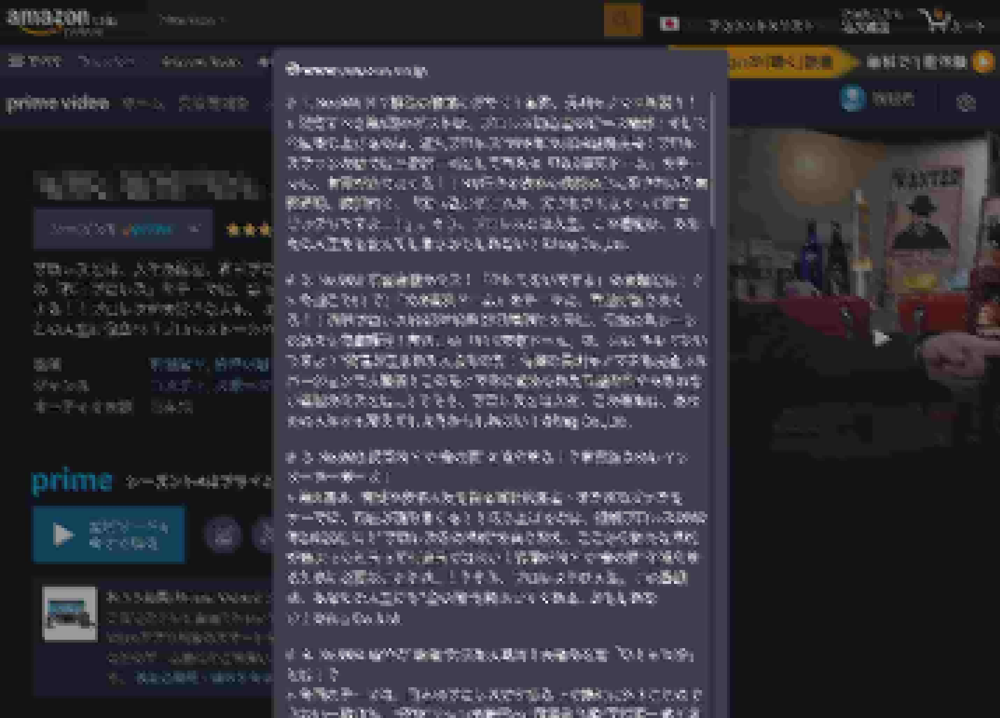

# prime-video-episodes



A bookmarklet to get the episode title and synopsis on the series page of amazon prime video.

You can get the info in following markdown format:

```markdown
# 1. I Am a Cat

> Lorem ipsum dolor sit amet, consectetur adipiscing elit, sed do eiusmod tempor incididunt ut labore et dolore magna aliqua. Leo vel fringilla est ullamcorper. Iaculis nunc sed augue lacus. Sed vulputate odio ut enim blandit. Fames ac turpis egestas sed.

# 2. Botchan

> Lorem ipsum dolor sit amet, consectetur adipiscing elit, sed do eiusmod tempor incididunt ut labore et dolore magna aliqua. Leo vel fringilla est ullamcorper. Iaculis nunc sed augue lacus. Sed vulputate odio ut enim blandit. Fames ac turpis egestas sed.

# 3. Kokoro

> Lorem ipsum dolor sit amet, consectetur adipiscing elit, sed do eiusmod tempor incididunt ut labore et dolore magna aliqua. Leo vel fringilla est ullamcorper. Iaculis nunc sed augue lacus. Sed vulputate odio ut enim blandit. Fames ac turpis egestas sed.
```

Output formatting can be modified by editing `template()` function in `main.ts`. In that case, run `npm run build` to rebuild the bookmarklet.
